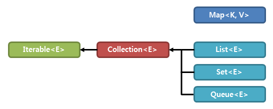

## [ 컬렉션 프레임워크 (Collection Framework) ]

- 다양한 알고리즘을 사용하여 데이터를 효율적으로 처리하도록 만들어 놓은 것
- 다수의 데이터를 다루기 위한 자료구조를 표현하고 사용하는 클래스의 집합
- 컬렉션 프레임워크의 모든 클래스는 Collection interface를 구현(implement)하는 클래스 또는 인터페이스

## < 컬렉션의 종류 > ArrayList를 제일 많이 씀

- 인터페이스로 정의되어 있고, 구현한 구현체 클래스를 사용

1. List<E> - Vector, ArrayList, LinkedList, Stack, Queue
   - 순서(인덱스)가 있음, 중복 데이터를 허용
   - 가변적인 배열
2. Set<E> - HashSet, TreeSet, LinkedHashSet
   - 순서(인덱스)가 없음, 중복 데이터를 허용하지 않음
3. Map<K, V> - HashMap, TreeMap, LinkedHashMap, Hashtable, Properties
   - 키(key)와 값(value)의 쌍을 하나의 데이터로 갖게 됨.
   - 키는 순서가 없고, 중복 키를 허용하지 않음, 값은 중복 데이터를 허용

ex) Stack, Queue ...

## < List(리스트) >

1. 순서가 없고, 중복 데이터를 허용
2. 가변적인(동적인) 배열 구조
3. Vector, ArrayList, LinkedList, Stack, Queue

raw type: 구체화 되지 않은 타입, 날 것의 타입 (데이터 타입)
generic type: 구체화된 타입, 일반화된 타입

### ArrayList 클래스

1. Vector 클래스의 기능, 사용법이 거의 동일
2. Vector의 쓰레드 동기화 기능이 성능의 저하를 일으키는 요인이 됨.
   -> ArrayList에서는 Vector의 쓰레드 동기화 기능을 제거하여 성능을 향상 시킴.
   -> 실제로 Vector보다 ArrayList를 많이 사용함.
3. Vector의 capacity(), element가 붙은 메서드는 없음.

[ArrayList와 LinkedList 접근 시간 측정]

1. ArrayList : 접근이 훨씬 빠름
2. LinkedList : 접근이 매우 느림

[ArrayList와 LinkedList의 추가/삭제 시간 비교]

1. ArrayList : 순차적인 추가/삭제가 빠름, 비순차적인(중간) 추가/삭제가 느림, 접근속도가 빠름.
2. LinkedList : 순차적인 추가/삭제가 느림, 비순차적인(중간) 추가/삭제가 빠름, 접근속도가 느림.

[목적과 용도에 따라 선택]

- ArrayList : 순차적인 데이터 다룰때 유용 / 검색이 빠름
- LinkedList : 데이터 중간 삽입에 유용 / 그거 빼고 다 단점 , 주소값 추가로 인한 메모리 낭비, 검색이 느림

### Stack(스택)

- 밑이 막혀있는 통처럼 생긴 데이터 저장 구조
- First In Last Out(FILO) : 선입후출
- 시스템의 지역변수를 저장하는 구조, 아주 중요한 데이터는 스택에 저장
- push : 스택에 데이터를 넣는 작업
- pop : 스택에서 데이터를 꺼내는 작업

### Queue(큐)

- 한 방향으로 데이터가 이동하는 파이프처럼 생긴 저장 구조
- 선입선출: First In Frist Out(FIFO)
- offer: 큐에서 데이터를 추가하는 작업
- poll: 큐에서 데이터를 꺼내는 작업, 꺼내고 나면 데이터는 삭제됨.

## < Set (셋) >

- 인터페이스
- 수학의 집합과 같은 원리의 저장 구조
- 특징: 순서가 없음(인덱스가 없음), 중복값을 허용하지 않음.
- 구현체 클래스: HashSet, LinkedHashSet, TreeSet

- HashSet - 장점: 데이터의 추가, 삭제가 빠름. 단점: 정렬되어 있지 않으므로 검색 속도가 느림.

### LinkedHashSet

- HashSet을 상속하는 자식 클래스
- HashSet의 입력순서와 출력순서가 다른 점을 보완하여 입력 순서와 출력 순서를 같게 만듦.
- 일반적인 다른 기능은 HashSet과 동일함.

### TreeSet

- 데이터를 추가할 때 root node를 기준으로 적은 것은 왼쪽, 큰 것은 오른쪽으로 추가하여 저장함.
- 데이터를 읽을 때는 왼쪽 아래의 leaf node부터 오른쪽으로 차례대로 읽음
- 왼쪽부터 오름차순으로 데이터가 저장되어 있음.
- 데이터가 저장된 모양이 나무의 모양과 흡사하여 Tree 구조가 됨.
- 장점: 오름차순으로 정렬, 검색 속도가 빠름.
- 단점: 데이터를 추가할 때 비교를 하므로 추가, 삭제시 많은 시간이 소요됨.

## < Map(맵) >

- 인터페이스
- 데이터는 키(Key)와 값(Value)의 쌍으로 구성됨.
- Map은 순서가 없음.
- Key는 중복이 없음.
- Value은 중복이 있음.
- 구현체 클래스: HashMap, LinkedHashMap, TreeMap

### TreeMap

- 키에 대해 오름차순으로 정렬된 형태로 저장되는 데이터 구조
- tree 알고리즘을 사용하여 root 키를 기준으로 작은 값은 왼쪽, 큰 값을 오른쪽으로 저장하는 방식
- 데이터를 저장할 때 오름차순으로 저장
- 키는 중복이 없음.
- 값은 중복이 있음.

## < Collections >

- 모든 컬렉션에 사용할 수 있는 메서드를 가지고 있는 클래스
- 거의 대부분의 메소드는 static으로 구현되어 있음.

## < Properties >

- 키와 값이 모두 문자열을 갖는 문자여렝 특화된 맵
- <T>의 키워드를 사용하지 않음
- 문자열에 특화된 HashMap이라고 생각하면 됨
- 데이터의 순서가 없음 (입력한 순서대로 나오지 않음)
