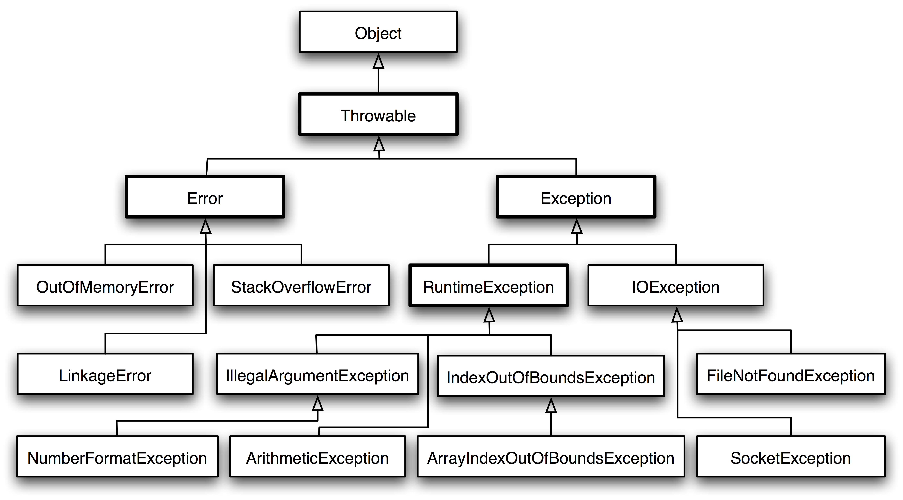

### < 예외처리 (Exception, Error Handling) >

- 예외처리의 목적

1. 예외의 발생으로 인한 실행 중인 프로그램의 비정상 종료를 막기 위해서
2. 개발자에게 알려서 코드를 보완할 수 있도록 하게 위해서

- Throwable(자바에서는 상속을 이용해서 모든 예외를 표현하고, 모든 예외 클래스는 Throwable의 자손 클래스)

1. Error 는 프로그램이 종료되어야 하는 심각한 문제. 대부분 컴퓨터나 JVM이 시스템적으로 동작할 수 없는 상황
2. Exception 은 프로그램이 종료되지는 않지만 예외나 문제상황을 표현하기 위해 사용

- 예외 상황은 대부분 Exception 종류
- 실행도중 발생하는 Exception은 RuntimeException을 상속받아서 정의
- 파일을 읽고 쓰거나, 원격에 있는 저장소로부터 데이터를 읽고 쓸 때 나는 에러를 표현하려면 IOException 을 상속받아서 정의

### < try-catch(-finally) 형식 >

try {
// 예외가 발생할 가능성이 있는 코드를 구현합니다.
} catch (FileNotFoundException e) {
// FileNotFoundException이 발생했을 경우,이를 처리하기 위한 코드를 구현합니다.
} catch (IOException e) {
// FileNotFoundException이 아닌 IOException이 발생했을 경우,이를 처리하기 위한 코드를 구현합니다.
} finally {
// 예외의 발생여부에 관계없이 항상 수행되어야하는 코드를 구현합니다.
}

- finally 구문은 필수는 아님
- 만약, 예외가 발생하지 않는다면 try → finally 순으로 실행
- 중복 catch블럭을 사용할 때는 먼저 선언된 catch블럭부터 확인함. 앞의 catch블럭에서 잡혔다면, 뒤의 catch블럭으로는 전파되지 않는다. 좁은 범위(상속관계에서 자식 클래스에 위치 할수록 좁은 범위)의 예외부터 앞에 선언하는 것이 좋다. 예를 들어서 IOException 이 발생할 것 같아 예외처리를 하고, 그 외의 예외도 예외처리를 하고 싶다면 IOException 을 catch 하는 구문을 먼저, Exception 을 catch하는 구문을 그 뒤에 작성

### < try-with-resource 형식 >

\* trycatch-finally구문보다 편리

- 기존의 try-catch(-finally)문은 자원을 닫을 때 close()를 사용해야 하지만,
- try-with-resource문은 try문을 벗어나는 순간 자동적으로 close()가 호출
- try()안의 입출력 스트림을 생성하는 로직을 작성할 때 해당 객체가 AutoClosable 인터페이스를 구현한 객체여야 함 -> AutoClosable 인터페이스에는 예외가 발생할 경우 close()메소드를 호출하기로 정의되어있기 때문
  try (FileOutputStream out = new FileOutputStream("test.txt")) {
  // test.txt file 에 Hello Sparta 를 출력
  out.write("Hello".getBytes());
  out.flush();
  } catch (IOException e) {
  e.printStackTrace();
  }

  → 이처럼 형식은 try-catch문과 비슷하지만, try()안에 AutoClosable 인터페이스를 구현한 객체를 선언하면 사용할 수 있다.

### < 메소드에서의 예외 선언 >

- catch문을 이용해서 예외처리를 하지 않은 경우, 메소드에 throws로 예외가 발생할 수 있다는 것을 알려주어야 함
- throws 키워드가 있는 함수를 호출한다면, caller 쪽에서 catch와 관련된 코드를 작성해주어야 함

  void method() throws IndexOutOfBoundsException, IllegalArgumentException {
  //메소드의 내용
  }
