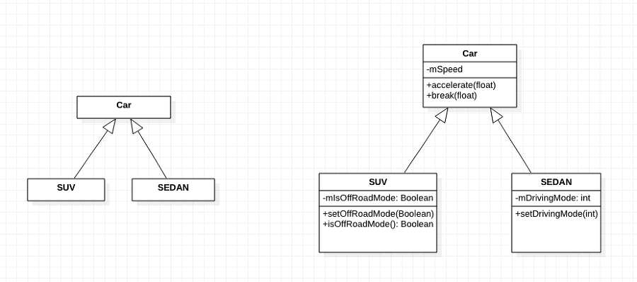

### < 상속 관계의 용어 정리 >

상속 - 상위 객체의 필드와 메소드를 하위 객체에게 물려받는 것 (상속의 주체는 자식)

상속 클래스 정의 - class 자식 클래스명 extends 부모클래스명

상속을 하는 클래스 - 기반(Base) 클래스, 부모 클래스, 슈퍼(super)클래스, 상위 클래스

상속을 받는 클래스 - 파생(Derived) 클래스, 자식 클래스, 서브(sub)클래스, 하위 클래스

### < 자산 >

- 부모에게서 물려 받는 것
- 멤버 변수, 멤버 메서드를 지칭, 초기자와 생성자는 포함되지 않음.

### < this와 super >

this.xxx: 같은 클래스의 멤버에 접근하는 방법

this() : 같은 클래스의 생성자 안에서 다른 생성자를 호출하는 방법

[super.xxx](http://super.xxx/): 자식 클래스 생성자 내에서(만) 부모 클래스 멤버에 접근하는 방법

super() : 자식 클래스의 생성자에서 부모 클래스의 생성자를 호출하는 방법

### < 오버라이딩 (Overriding) > - 과도하게 짐을 지웠다

- 메서드의 재정의
- 상속의 관계에서 부모 클래스의 메서드를 자식 클래스에서 재정의 하는 것
- 자식 클래스의 메서드는 부모 클래스의 메서드와 완벽하게 일치해야 함. (이름, 매개변수, 반환타입)
- 접근 제한은 부모 클래스 메서드보다 강한 접근 제한을 사용할 수 업음.(동등하거나 약한 접근 제한을 사용)

### < Object 클래스 >

- 자바의 상속 관계를 만들어주는 최상위 클래스
- 자바의 다른 클래스로부터 상속받지 않은 모든 클래스는 Object 클래스의 자식 클래스
- 다른 클래스로부터 상속받지 않은 클래스는 extends Object가 생략되어 있음
- java.lang 패키지에 속해 있어서 따로 import를 하지 않아도 됨

### < Object 클래스의 메서드들 >

- toString(): 객체의 정보를 리턴함
- equals(): 객체를 비교할 때 사용함.
- hashCode(): 객체를 비교하는 아이디를 리턴함.
- clone(): 객체의 복사본을 리턴함.
- finalize(): 객체가 소명할 때 호출되어 사용함.
- getClass(): 객체의 정보를 담고 있는 Class의 인스턴스를 리턴함.
- notify(), notifyAll(), wait(): Thread에서 사용하는 메서드

toString(), equals(), hashCode() 메서드는 자식 클래스에서 오버라이딩하여 사용

모든 메서드의 접근제어자는 public으로 되어 있음

### < 다형성 (polymorphism) >

- 하나의 방법으로 여러가지를 한꺼번에 처리하는 것
- 부모 클래스 배열을 만들어 부모 인스턴스와 자식 인스턴스를 담아서 반복문을 통해서 한꺼번에 처리할 수 있도록 하는 것 (부모는 자식을 받아준다)

상속과 구현은 같이 할 수 있지만, 상속을 먼저 하고 구현을 해야 한다.
-> 왜? 다중 상속은 안되지만 다중 구현은 가능하기 때문
-> 왜? 다중 구현이 가능한 이유는 추상 메서드기 때문에 이름이 같아도 그냥 가져옴
구현은 부모의 범주지만 부모는 아님
